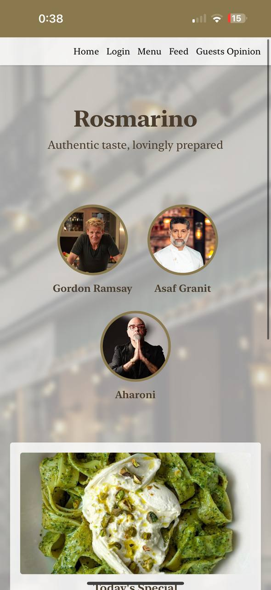

## Rosmarino – Italian Restaurant Website

A clean and elegant static website for an Italian restaurant, built using HTML, CSS, and TailwindCSS. It includes a responsive layout, daily specials, and reservation options.

  

## Features
- Tailwind-based responsive layout
- Chef section and daily special
- Organized food menu
- Reservation and membership calls-to-action

## Phone view
- icon:
  

  

  
  
  
  

### desktop application view

  

  

  
  

   

