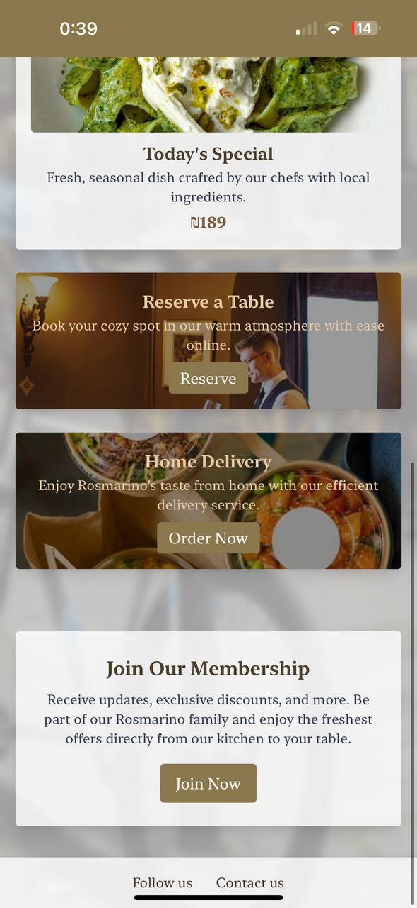
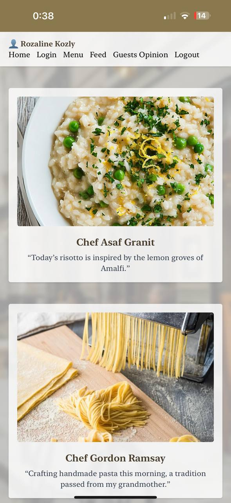
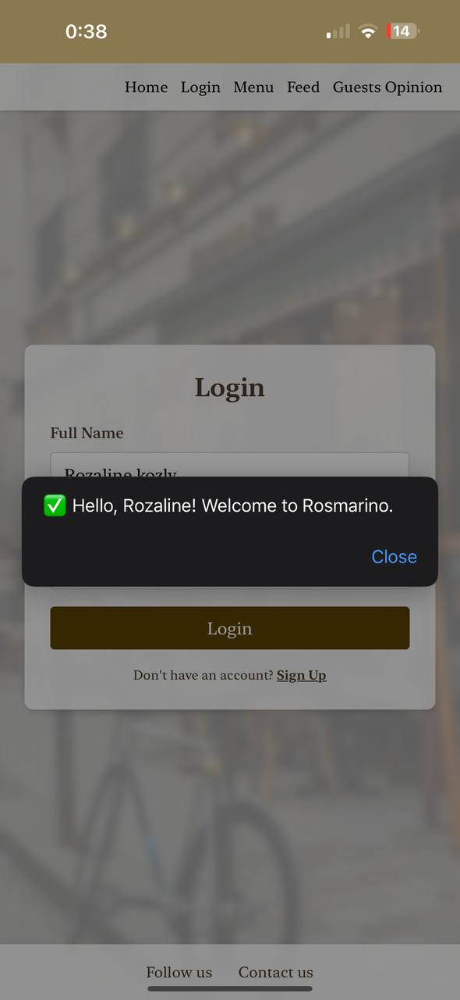

## Rosmarino – Italian Restaurant Website

A clean and elegant static website for an Italian restaurant, built using HTML, CSS, and TailwindCSS. It includes a responsive layout, daily specials, and reservation options.

  

## Features

- **Responsive Design:** Seamless experience on mobile, tablet, and desktop.
- **Interactive Menu:** Starters, main courses, desserts, and daily specials with high-quality images.
- **Progressive Web App (PWA):** Installable on desktop and mobile for an app-like experience!
- **Login & Membership:** Basic login functionality and membership call-to-action.
- **Smooth Navigation:** Intuitive navigation for exploring dishes and sections.
- **Modern UI with TailwindCSS:** Clean, elegant design aligned with the Italian restaurant theme.
- **Fast Deployment:** Hosted securely on Vercel with HTTPS and fast loading.
- **Database Supported:** by Supabase useing firebase.

## Phone view
- icon:
  

  

preview:

  
  
  
  

  

  
  

### desktop application view
icon:

  

  

  preview:
  

   

